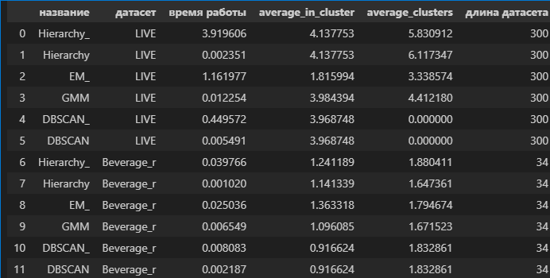
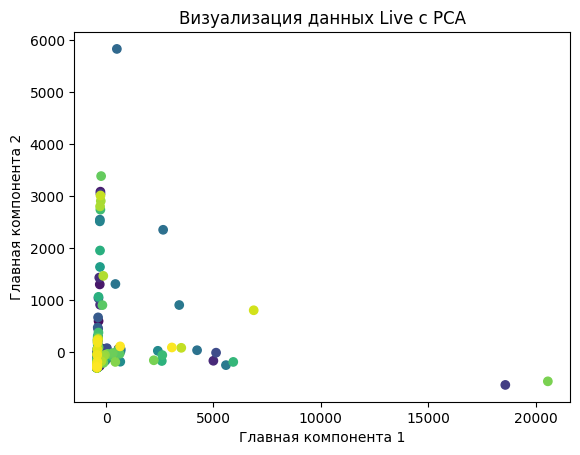
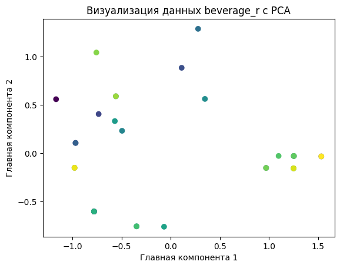
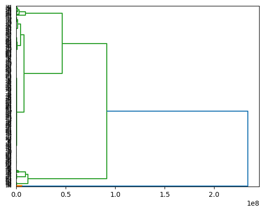
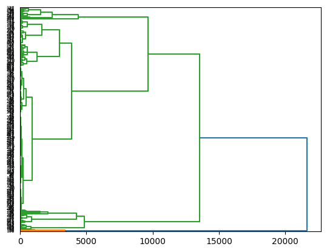
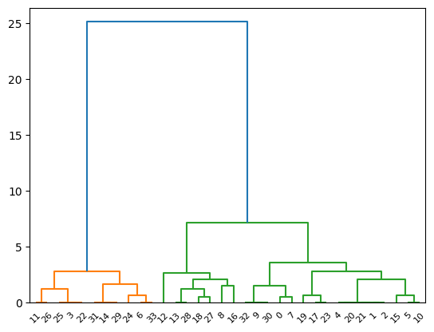

# Лабораторная работа 1

В данной лабораторной работе были разработаны и протестированы три метода кластеризации, реализованные в файле `my_hierarchy.py`:

1. **Иерархическая кластеризация (Hierarchy)**
2. **DBSCAN (DBSCAN)**
3. **EM (EM)**

Кроме того, была добавлена функция для расчёта оптимального числа кластеров — `optimal_clusters_amount`.

## Используемые Датасеты

Для проверки и анализа работы алгоритмов были использованы следующие два датасета:

1. **LIVE**
2. **Beverage**

## Результаты

### 1. Сравнение методов кластеризации

Каждый метод кластеризации был протестирован и сравнён с эталонным решением. Ниже представлено сравнение метрик:

### 2. Результаты PCA для 2 датасетов

Для лучшего понимания структуры данных была проведена процедура анализа главных компонент (PCA) для датасетов **LIVE** и **Beverage**. Результаты визуализации для обоих датасетов приведены ниже рядом для удобства сравнения:

| LIVE | Beverage |
|------|----------|
|  |  |

### 3. Сравнение дендрограмм

Для проверки точности собственной реализации иерархической кластеризации было выполнено сравнение дендрограмм с эталонной реализацией. Дендрограммы для каждого датасета представлены рядом:

**LIVE**

| Собственная реализация | Эталонная реализация |
|------------------------|----------------------|
|  |  |

**Beverage**

| Собственная реализация | Эталонная реализация |
|------------------------|----------------------|
|  |  |

## Заключение

Методы кластеризации были успешно реализованы и протестированы на двух различных датасетах. Визуализация результатов, включая PCA и дендрограммы, позволила провести оценку качества кластеризации и сравнение с эталонными решениями.